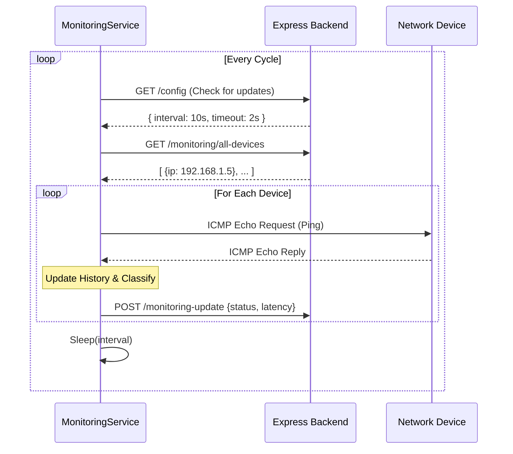
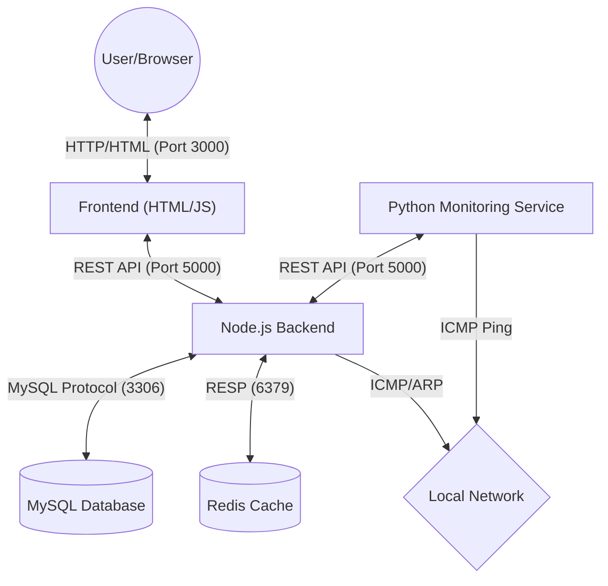

# Network Monitoring Dashboard - API Documentation

This document describes the REST API endpoints available in the backend of the Network Devices Monitoring Dashboard (NDMD).

## Base URL
`http://localhost:5000/api`

## Authentication

All protected routes require authentication.

1.  **Login**: Returns a `refreshToken` (HttpOnly Cookie) and an `accessToken` (JSON body).
2.  **Protected Requests**: Include the access token in the headers for all requests to protected routes.
    *   **Header**: `Authorization`
    *   **Value**: `Bearer <your_access_token>`

---

## Endpoints

### 1. Authentication (`/auth`)

| Method | Endpoint | Description | Auth Required | Request Body | Response |
| :--- | :--- | :--- | :--- | :--- | :--- |
| **POST** | `/login` | Authenticate user | No | `{"username": "...", "password": "..."}` | `{ accessToken, user: {...} }` |
| **POST** | `/refresh-token` | Get new access token | No (Cookie) | None (Requires `refreshToken` cookie) | `{ accessToken }` |
| **POST** | `/security-questions` | Get user's security questions | No | `{"username": "..."}` | `{ question1, question2 }` |
| **POST** | `/reset-password` | Reset password using security answers | No | `{"username": "...", "securityAnswer1": "...", "securityAnswer2": "...", "newPassword": "..."}` | `{ message }` |

### 2. Devices (`/devices`)

| Method | Endpoint | Description | Auth Required | Request Body | Response |
| :--- | :--- | :--- | :--- | :--- | :--- |
| **GET** | `/` | Get all devices | Yes | None | `{ devices: [...] }` |
| **GET** | `/{id}` | Get specific device details | Yes | None | `{ device: {...} }` |
| **POST** | `/` | Add a new device | Yes | `{"name": "...", "ip_address": "..."}` (MAC optional) | `{ message, device: {...} }` |
| **PUT** | `/{id}` | Edit a device | Yes | `{"name": "...", "ip_address": "...", "mac_address": "..."}` | `{ message }` |
| **DELETE** | `/{id}` | Delete a device | Yes | None | `{ message }` |
| **DELETE** | `/clear-all` | Delete all devices | Yes | None | `{ message, deletedCount }` |

### 3. Monitoring (`/monitoring`)

| Method | Endpoint | Description | Auth Required | Request Body | Response |
| :--- | :--- | :--- | :--- | :--- | :--- |
| **GET** | `/all-devices` | List devices (ID, Name, IP) for monitoring service | No | None | `{ devices: [{deviceId, name, ipAddress}, ...] }` |
| **GET** | `/refresh-interval` | Get global refresh interval | No | None | `{ refresh_interval }` |
| **GET** | `/status-logs` | Get recent status logs | No | None | `{ logs: [...] }` |
| **POST** | `/monitoring-update` | Receive status update from monitoring service | No | `{"device_id": 1, "status": "online", "latency_ms": 15}` | `{ message }` |
| **POST** | `/scan` | Trigger network scan to find new devices | Any | None | `{ message, devicesFound, devices }` |

### 4. Dashboard (`/dashboard`)

| Method | Endpoint | Description | Auth Required | Request Body | Response |
| :--- | :--- | :--- | :--- | :--- | :--- |
| **GET** | `/overview` | Get high-level stats (total, online, offline) | Yes | None | `{ totalDevices, onlineCount, offlineCount, unstableCount }` |
| **GET** | `/device-summary` | Get latest status for all devices | Yes | None | `{ devices: [...] }` |
| **GET** | `/uptime-summary` | Get uptime percentage for devices | Yes | None | `{ uptime: [...] }` |

### 5. Configuration (`/configs`)

| Method | Endpoint | Description | Auth Required | Request Body | Response |
| :--- | :--- | :--- | :--- | :--- | :--- |
| **GET** | `/` | Get current configs (Interval, Timeout, Retry) | No | None | `{ pingInterval, pingTimeout, retryCount }` |
| **PUT** | `/` | Update configs | Yes | `{"pingInterval": 5000, "pingTimeout": 2, "retryCount": 3}` | `{ message, ... }` |

---

## Testing with Postman / Restfox

### 1. Environment Setup
Create a new Environment (e.g., "Localhost") and add these variables:
*   `baseUrl`: `http://localhost:5000/api`
*   `accessToken`: (Leave empty initially)

### 2. Authenticating
1.  Create a **POST** request to `{{baseUrl}}/auth/login`.
2.  **Body (JSON)**:
    ```json
    {
      "username": "admin",
      "password": "your_password"
    }
    ```
3.  **Tests (Script to auto-save token)**:
    ```javascript
    // Postman/Restfox Script
    var jsonData = pm.response.json();
    pm.environment.set("accessToken", jsonData.accessToken);
    ```
    *Now, running this request will automatically save your access token for subsequent requests.*

### 3. Making Authenticated Requests
For endpoints that require Auth (Review table above):
1.  Go to the **Authorization** tab.
2.  Type: **Bearer Token**.
3.  Token: `{{accessToken}}` (This retrieves the variable saved from the login step).

### 4. Example: Add a Device
1.  Create a **POST** request to `{{baseUrl}}/devices`.
2.  **Authorization**: Inherit from parent or set Bearer Token.
3.  **Body (JSON)**:
    ```json
    {
      "name": "Test Server",
      "ip_address": "192.168.1.50"
    }
    ```
4.  Send and check usage.

### 5. Example: Update Configs
1.  Create a **PUT** request to `{{baseUrl}}/configs`.
2.  **Authorization**: Bearer Token.
3.  **Body (JSON)**:
    ```json
    {
      "pingInterval": 10000,
      "pingTimeout": 5,
      "retryCount": 3
    }
    ```

# Project File Structure Documentation

This document provides a comprehensive overview of the `Network-Devices-Monitoring-Dashboard-NDMD` project structure and explains the purpose of each file.

## 📂 Root Directory
| File | Description |
| :--- | :--- |
| `start.sh` | Main entry point script. Starts Redis, Backend, Frontend Server, and Monitoring Service concurrently. |
| `API_DOCUMENTATION.md` | Detailed documentation of the Backend REST API endpoints. |
| `README.md` | Project overview, setup steps, and usage instructions. |
| `requirements.txt` | Top-level Python dependencies file (referenced by deployment scripts). |
| `*.log` | Log files for different services (`backend.log`, `frontend.log`, `monitoring.log`). |

---

## 📂 backend/
The Node.js Express application serving the API and static frontend files.

### Core Files
| File | Description |
| :--- | :--- |
| `server.js` | Main entry point for the Backend API. Sets up Express, routes, and database connections. |
| `frontend-server.js` | A simple server (likely for dev) to serve the `public` folder on a separate port (3000). |
| `seed.js` | Script to seed the database with initial data (Admin user, default settings). |
| `package.json` | Node.js dependencies and scripts. |

### 📂 config/
| File | Description |
| :--- | :--- |
| `db.js` | MySQL database connection configuration and pool creation. |
| `redisClient.js` | Redis client configuration for caching and interaction. |

### 📂 routes/ (API Endpoints)
| File | Description |
| :--- | :--- |
| `authRoutes.js` | Routes for Login, Password Reset, and Token Refresh. |
| `deviceRoutes.js` | CRUD routes for managing network devices. |
| `monitoringRoutes.js` | Routes for the python service to report status and fetch configs. |
| `dashboardRoutes.js` | Routes for dashboard statistics (uptime, overview). |
| `configRoutes.js` | Routes for viewing and updating system configurations. |

### 📂 controllers/ (Business Logic)
| File | Description |
| :--- | :--- |
| `authController.js` | Handles user authentication, logic, and JWT generation. |
| `deviceController.js` | Logic for adding, editing, deleting, and listing devices. |
| `monitoringController.js` | Processes updates from the monitoring service and logs statuses. |
| `dashboardController.js` | Aggregates data for the dashboard view. |
| `configController.js` | Handles getting and setting global configuration values. |

### 📂 middlewares/
| File | Description |
| :--- | :--- |
| `authMiddleWare.js` | Middleware to verify JWT Access Tokens on protected routes. |

### 📂 services/
| File | Description |
| :--- | :--- |
| `networkScanner.js` | Service to scan the local network for new devices (likely using ARP/Ping). |

### 📂 public/ (Frontend)
The vanilla HTML/CSS/JS frontend.

| File | Description |
| :--- | :--- |
| `index.html` | Landing page. |
| `login.html` | Admin login page. |
| `dashboard.html` | Main dashboard view showing device statuses. |
| `settings.html` | Configuration page for Ping Interval, Timeout, etc. |
| `logs.html` | View for historical device logs. |
| `style.css` | Global styles. |
| `js/` | Directory containing frontend logic scripts (not fully listed but implied). |

---

## 📂 monitoring-service/
The Python-based service responsible for pinging devices and reporting status.

| File | Description |
| :--- | :--- |
| `main.py` | Entry point. Instantiates and starts the `MonitoringService`. |
| `verify_configs.py` | Script to verify that the service is correctly fetching configs from the backend. |

### 📂 monitoring/
| File | Description |
| :--- | :--- |
| `monitoring_service.py` | Core class that runs the main loop, manages devices, and coordinates checking. |
| `device_monitor.py` | Class representing a single device, handling its ping history and status logic. |
| `ping_service.py` | Wrapper around `ping3` to send ICMP packets. Handles timeouts and retries. |
| `status_classifier.py` | Logic to determine if a device is Online, Unstable, or Offline based on history. |

### 📂 config/
| File | Description |
| :--- | :--- |
| `settings.py` | Configuration classes that fetch settings (Interval, Timeout) from the Backend API. |

### 📂 backend_communication/
| File | Description |
| :--- | :--- |
| `api_client.py` | (Likely) Helper functions to perform HTTP requests to the Backend. |

---

## 📂 deployment/
scripts for setting up the environment.

| File | Description |
| :--- | :--- |
| `deploy.sh` | Interactive script to install dependencies (Node, Python, MySQL, Redis) and set up the app. |
| `README.md` | Specific instructions for deployment. |

---

## 📂 database/
| File | Description |
| :--- | :--- |
| `db.sql` | SQL Schema file to create the `testbackend` database and tables (`users`, `devices`, etc.). |


# Backend Architecture Documentation

This document provides a technical overview of the backend architecture for the Network Devices Monitoring Dashboard (NDMD).

## 1. High-Level Overview

The backend is built using **Node.js** with **Express.js** as the web framework. It follows a **MVC (Model-View-Controller)** pattern (though models are implicit via direct SQL queries).

*   **Runtime**: Node.js (v20.x recommended)
*   **Database**: MySQL
*   **Caching/State**: Redis (Used for rate limiting, locking, and dashboard caching)
*   **Communication**: REST API (JSON)

## 2. Core Components

### A. Entry Point (`server.js`)
*   Initializes the Express app.
*   Connects to MySQL and Redis.
*   Registers all API routes (`/api/auth`, `/api/devices`, etc.).
*   Starts the `NetworkScanner` service on boot.
*   Serves the static frontend (if configured).

### B. Database Layer
*   **`config/db.js`**: Manages a MySQL connection pool using `mysql2/promise`. This allows for concurrent queries and auto-reconnection.
*   **`config/redisClient.js`**: Configures the Redis client for caching and session-like features (e.g., login attempts).

### C. Authentication Layer (`authController.js`)
The system uses **JWT (JSON Web Tokens)** for stateless authentication.
*   **Login Flow**:
    1.  User submits username/password.
    2.  Backend verifies credentials (bcrypt hash comparison).
    3.  Backend checks Redis for rate limiting (lockout after 3 failed attempts).
    4.  **Access Token** (short-lived, 8h) is returned in the response body.
    5.  **Refresh Token** (long-lived, 7d) is returned in an **HttpOnly Cookie**.
*   **Security Questions**: Used for password resets. Questions/Answers are stored in the `users` table.

## 3. Services & Logic

### A. Network Scanner (`services/networkScanner.js`)
Responsible for discovering devices on the local network.
*   **Logic**:
    1.  **Detect Subnet**: Identifies the local network interface and subnet (e.g., `192.168.1.0/24`).
    2.  **Ping Sweep**: Iterates through all 254 IPs in the subnet, sending ICMP packets (using system `ping`) to detect active hosts.
    3.  **ARP Lookup**: Reads `/proc/net/arp` or runs `arp -n` to resolve MAC addresses for active IPs.
    4.  **Database Sync**:
        *   Matches found devices against the `devices` table (by MAC first, then IP).
        *   Updates existing devices (IP changes, status).
        *   Inserts new devices.
        *   Marks devices not found in the scan as `offline`.

### B. Device Management (`deviceController.js`)
Standard CRUD operations for the `devices` table.
*   Allows adding manual devices (e.g., external servers).
*   Handles MAC address resolution if only IP is provided.

### C. Monitoring Integration (`monitoringController.js` & `monitoring-service/`)
The backend acts as the "Brain", while the Python `monitoring-service` acts as the "Probe".
1.  **Config Fetching**: Python service polls `/api/configs` to get `ping_interval`, `timeout`, etc.
2.  **Device Fetching**: Python service polls `/api/monitoring/all-devices` to get the list of targets.
3.  **Status Reporting**: Python service pushes updates to `/api/monitoring/monitoring-update`.
4.  **Logging**: The backend logs these updates into the `status_logs` table for historical tracking.

## 4. Frontend Integration
The backend serves the API at port `5000`. The frontend (static HTML/JS) runs on port `3000` (via `frontend-server.js`) and proxies requests or calls the API directly.
*   **Dashboard Updates**: The frontend polls `/api/dashboard/overview` or uses websockets (if implemented, currently polling seems to be the main method via `dashboard.html` JS).

## 5. Security Features
*   **Password Hashing**: `bcryptjs`
*   **Rate Limiting**: Redis-based lockout on login endpoints.
*   **Input Validation**: Basic validation in controllers (IP format, required fields).
*   **Cookie Security**: Refresh tokens are `HttpOnly` and `Secure`.

# Monitoring Service Architecture

This document provides a technical deep-dive into the `monitoring-service` component of the NDMD project. This service is a Python application responsible for actively checking the status of network devices.

## 1. High-Level Logic

The service runs an **infinite loop** that performs the following steps in each cycle:
1.  **Fetch Configuration**: Updates global settings (Ping Interval, Timeout, Retries) from the Backend.
2.  **Fetch Devices**: Gets the latest list of IPs to monitor from the Backend.
3.  **Sync Local State**: Adds new devices to internal tracking or removes deleted ones.
4.  **Check All Devices**: Pings each device sequentially (or concurrently, depending on strict implementation).
5.  **Report Status**: Sends the result (Status, Latency) back to the Backend.
6.  **Sleep**: Waits for the configured `ping_interval` before starting the next cycle.

## 2. Core Components

### A. Main Service (`monitoring_service.py`)
The `MonitoringService` class orchestrates the lifecycle.
*   **Startup**: `start()` initiates the main loop.
*   **Device Management**: Maintains a dictionary `self._devices` mapping `device_id` -> `DeviceMonitor` object. This ensures we keep history for devices across cycles.
*   **Error Handling**: Catches exceptions during fetching or pinging to prevent the service from crashing.

### B. Device Monitor (`monitoring/device_monitor.py`)
Represents a "Smart Tracker" for a single device.
*   **Purpose**: To prevent "flapping" (status rapidly switching between online/offline).
*   **Ping History**: Stores the last 5 ping results.
*   **Logic**:
    *   `check_device()` calls `ping_service` to get current latency.
    *   Updates history.
    *   Calls `status_classifier` to determine the new status.
    *   Returns a payload ready for the backend.

### C. Ping Service (`monitoring/ping_service.py`)
A low-level wrapper around the `ping3` library.
*   **Features**:
    *   Fetches `PING_TIMEOUT_CONFIG` and `RETRY_COUNT_CONFIG` dynamically.
    *   **Retry Logic**: If a ping fails, it retries `N` times (configured) before declaring the device unreachable.
    *   Returns `float` (latency in seconds) on success, or `None` on failure.

### D. Status Classifier (`monitoring/status_classifier.py`)
Determines the device state based on its **Ping History** (last 5 pings).
*   **OFFLINE**: All pings in history failed (or history is empty).
*   **UNSTABLE**:
    *   More failures than successes in the recent window.
    *   Average latency > **200ms**.
*   **ONLINE**: Consistent successful responses with low latency.

### E. Configuration (`config/settings.py`)
Manages configuration fetching.
*   **Classes**: `PING_INTERVAL_CONFIG`, `PING_TIMEOUT_CONFIG`, `RETRY_COUNT_CONFIG`.
*   **Logic**:
    *   Tries to fetch from `http://localhost:5000/api/configs`.
    *   Falls back to defaults (e.g., Interval=5s, Timeout=2s) if Backend is unreachable.
    *   Enforces min/max boundaries (Validation).

## 3. Communication

The service uses simple HTTP REST calls to talk to the backend. These are encapsulated in `backend_communication/api_client.py`.

*   **GET** `/api/monitoring/all-devices`: Returns `[{ "deviceId": 1, "ipAddress": "...", ... }]`.
*   **GET** `/api/configs`: Returns global settings.
*   **POST** `/api/monitoring/monitoring-update`: Sends:
    ```json
    {
      "device_id": 1,
      "status": "online",
      "latency_ms": 15
    }
    ```

## 4. Dependencies

*   **Python 3.x**
*   `requests` (HTTP Client)
*   `ping3` (ICMP Ping implementation, requires root/capability usually, but `ping3` tries to use unprivileged ICMP sockets if available).

## 5. Flow Diagram



# System Communication & Data Flow

This document details how the different components of the Network Devices Monitoring Dashboard (NDMD) communicate with each other. The system relies on a central **Backend API** that coordinates data between the User Interface (Frontend), the Database, and the Monitoring Service.

## 1. Architecture Overview



## 2. Communication Pathways

### A. Frontend ↔ Backend
**Protocol**: HTTP / JSON
**Type**: Client-Server (Request-Response)

The Frontend is a "Single Page Application" (SPA) style consumer of the Backend API.
*   **Authentication**: The frontend sends credentials (`POST /auth/login`). The backend responds with an `accessToken` (JSON) and sets a `refreshToken` (HttpOnly Cookie).
*   **Polling**: The dashboard updates itself by periodically polling endpoints like `GET /dashboard/overview` or `GET /devices` (every few seconds, controlled by `dashboard.html` JS).
*   **Authorization**: Every protected request from the frontend includes the header: `Authorization: Bearer <token>`.

### B. Backend ↔ Database (MySQL)
**Protocol**: TCP (Port 3306)
**Type**: Persistent Connection Pool

*   **Connection**: The backend uses a connection pool (via `mysql2`). This means it maintains multiple open connections to the DB to handle concurrent requests efficiently without the overhead of opening a new handshake for every query.
*   **Data**: Stores persistent data: User accounts, Device list, Configuration, and Historical Logs.

### C. Backend ↔ Redis
**Protocol**: RESP (Redis Serialization Protocol) over TCP (Port 6379)
**Type**: Key-Value Store

*   **Usage**:
    *   **Rate Limiting**: Stores login attempt counts (`login:attempts:username`).
    *   **Caching**: Stores computed dashboard stats (`dashboard:overview`) to reduce load on MySQL for frequent polls.
    *   **Locks**: Prevents race conditions during heavy operations (like scans).

### D. Monitoring Service ↔ Backend
**Protocol**: HTTP / JSON
**Type**: Polling Consumer & Push Producer

The Monitoring Service is an autonomous agent that "reports" to the Backend. It does **not** have a direct connection to the Database or Redis.
*   **Pull Configs**: Periodically asks "What should I do?" via `GET /config` and `GET /monitoring/all-devices`.
*   **Push Status**: When it finishes checking a device, it pushes results via `POST /monitoring/monitoring-update`.
    *   *Why this design?* It decouples the monitoring logic. The monitoring service could be running on a different server entirely (e.g., a satellite probe) and would still work as long as it can reach the Backend API.

### E. Services ↔ Local Network
**Protocol**: ICMP (Ping) & ARP
**Type**: Network Layer / Link Layer

*   **Network Scanner (Backend)**: Uses system calls (exec) to run `ping` and `arp -n` to discover new devices.
*   **Monitoring Service**: Uses `ping3` (Python library using Raw Sockets) to send ICMP Echo Requests to targets.

## 3. Data Flow Example: Status Update

1.  **Time T**: Monitoring Service wakes up loop.
2.  **Pull**: Service calls Backend `GET /all-devices`.
    *   *Backend queries MySQL -> Returns list [IP: 192.168.1.50].*
3.  **Action**: Service pings `192.168.1.50`.
    *   *Result: Success, 15ms latency.*
4.  **Push**: Service calls Backend `POST /monitoring-update`.
    *   Payload: `{id: 5, status: "online", latency: 15}`.
5.  **Process**:
    *   Backend updates `devices` table (Set status='online').
    *   Backend inserts row into `status_logs`.
    *   Backend **invalidates** Redis cache (`dashboard:overview`) so the next user poll sees fresh data.
6.  **View**: User's browser polls `GET /dashboard/overview`.
    *   Backend sees empty cache -> Re-queries MySQL -> Returns updated count.

